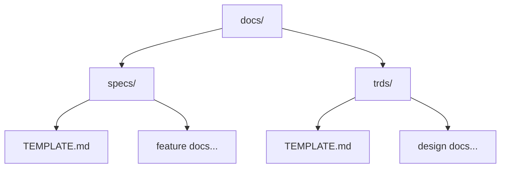
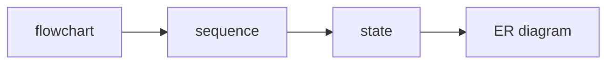

# Documentation

<!-- LLM HINT: This is the central guide for all documentation in this repository. Start here to understand conventions before creating or editing docs. -->

This directory is the single source of truth for project documentation. Everything lives here—not in wikis, not in tickets, not scattered across third-party tools.

## Why This Matters

In LLM-assisted development, documentation quality directly impacts productivity. Poor docs mean wasted tokens, broken inference loops, and endless iterations to get something commit-worthy. Good docs compound—they make every future interaction faster and more accurate.

Treating documentation as code means it gets reviewed, versioned, and iterated alongside the features it describes. That's the standard here.

## What's Inside



| Directory | Purpose | When to Use |
|-----------|---------|-------------|
| `specs/` | Feature specifications | Defining *what* to build and *why* |
| `trds/` | Technical requirement documents | Defining *how* to build it |

### Specs vs TRDs

**Specs** answer product questions: What problem are we solving? Who benefits? What does success look like?

**TRDs** answer engineering questions: What's the architecture? How do components interact? What are the trade-offs?

A feature typically has one spec that spawns one or more TRDs. The spec stays stable while TRDs may evolve as implementation details change.

## Creating New Documentation

1. **Pick the right template**
   - Feature or product requirement → `specs/TEMPLATE.md`
   - Technical design or architecture → `trds/TEMPLATE.md`

2. **Copy and rename**

   ```bash
   cp docs/specs/TEMPLATE.md docs/specs/my-feature.md
   ```

3. **Fill in every section**
   Don't skip sections that feel "not applicable." Work through them—often you'll discover requirements you hadn't considered. Use an LLM to brainstorm if stuck.

4. **Add diagrams**
   Every document needs at least one Mermaid diagram. Visuals convey relationships faster than prose.

5. **Get review**
   Docs are code. They go through PR review like everything else.

## Conventions

### File Naming

- Use kebab-case: `user-authentication.md`
- Prefix drafts with `_draft-`: `_draft-new-feature.md`
- Templates are uppercase: `TEMPLATE.md`

### Writing Style

- **Sentence case** for headers: "User authentication" not "User Authentication"
- **Maximum depth**: H3—no H4 or beyond
- **Lead with why**: Explain motivation before diving into details
- **Bullet points** over walls of text
- **Code blocks** for anything technical, including paths and commands

### Diagrams

Use Mermaid.js exclusively. Supported types:



**Always preview before committing.** A broken diagram undermines trust in the entire document.

## LLM Integration

### Embedding Hints

Use HTML comments to guide AI tools without cluttering the readable document:

```markdown
<!-- LLM HINT: This section covers OAuth integration. 
     The provider is Google, tokens are stored in Redis. -->
```

Place hints at the start of complex sections. They're invisible to humans but invaluable for LLMs navigating the doc.

### Cross-References

Link related documents with relative paths:

```markdown
See the [Authentication TRD](./trds/authentication.md) for implementation details.
```

This helps both humans and LLMs trace relationships between specs and implementations.

## Quality Checklist

Before merging any documentation:

- [ ] Started from the correct template
- [ ] All sections filled in (no placeholders left)
- [ ] At least one Mermaid diagram included
- [ ] Diagrams render correctly in preview
- [ ] No broken internal links
- [ ] Spell-checked
- [ ] Reviewed by at least one other person

## Examples

See these completed documents for reference:

- [User Authentication Spec](./specs/user-authentication.md) - A feature specification
- [Authentication TRD](./trds/authentication.md) - The corresponding technical design
