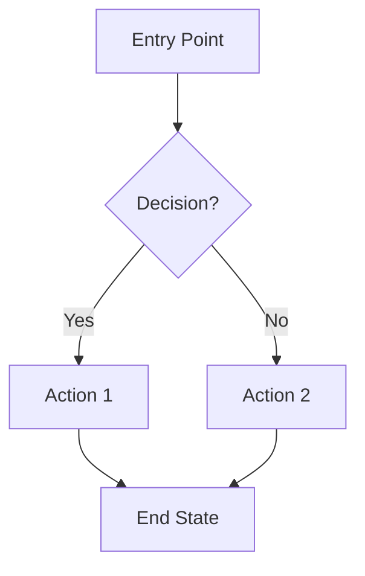

# Feature: [Feature Name]

> [!NOTE]
> **Template rules:**
> - Replace all `[bracketed placeholders]` with real content
> - Remove blockquoted guidance (like this) before publishing
> - Keep HTML comments (LLM hints) - they're for AI assistants
> - Fill in ALL sections, even if brief

<!--
LLM HINT: This is a feature specification template.
- Keep sections concise and actionable
- Focus on WHAT and WHY, leave HOW to TRDs
- Link to related TRDs for implementation details
-->

**Status**: Draft | In Review | Approved | Implemented
**Author**: [Name]
**Last Updated**: YYYY-MM-DD

## Overview

<!-- 1-2 paragraphs describing the feature at a high level. Answer: What is this? Why does it matter? -->

> Describe the feature and its value proposition in 1-2 paragraphs. Focus on the problem being solved and who benefits.

## User stories

<!-- Keep to 3-5 core user stories. Each should be testable. -->

> Replace these placeholder stories with real ones. Each story should follow the format and be specific enough to test.

- As a [user type], I want to [action] so that [benefit]
- As a [user type], I want to [action] so that [benefit]
- As a [user type], I want to [action] so that [benefit]

## Requirements

<!--
LLM HINT: Requirements should be specific and testable.
Functional = what the system does. Non-functional = how well it does it.
-->

### Functional

<!-- What the system must do. Be specific and testable. -->

> List concrete, testable requirements. Use Must/Should/Could priorities.

| ID | Requirement | Priority |
|----|-------------|----------|
| F1 | [Requirement description] | Must |
| F2 | [Requirement description] | Should |
| F3 | [Requirement description] | Could |

### Non-functional

<!-- Performance, security, accessibility, etc. -->

> Define measurable quality attributes. Include specific thresholds.

- **Performance**: [e.g., Page load < 2s]
- **Security**: [e.g., All data encrypted at rest]
- **Accessibility**: [e.g., WCAG 2.1 AA compliant]

## User flow

<!-- Mermaid diagram showing the happy path. Keep it simple. -->

> Replace this example diagram with the actual user flow. Show the primary happy path.

## Out of scope

<!-- Explicitly state what this feature does NOT include. Prevents scope creep. -->

> List items explicitly excluded from this feature. This prevents scope creep and sets clear boundaries.

- [Thing explicitly not included]
- [Another thing not included]

## Open questions

<!-- Track decisions that need to be made. Remove once resolved. -->

> Track unresolved decisions here. Check off and document answers as they're resolved. Remove this section when all questions are answered.

- [ ] [Question needing resolution]
- [ ] [Another open question]

## References

- [Related TRD](../trds/related-trd.md)
- [External documentation](https://example.com)
