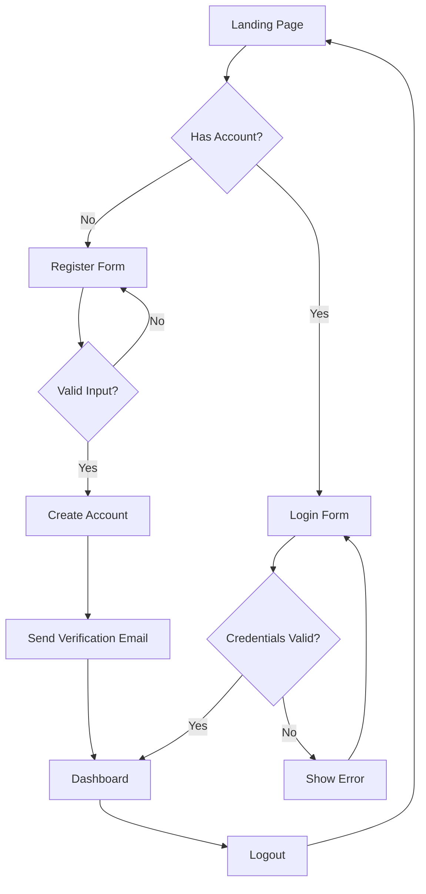

# Feature: User Authentication

<!-- 
LLM HINT: This is an example of a completed feature spec.
It demonstrates the template in use for a common feature.
Reference this when filling out new specs.
-->

**Status**: Approved  
**Author**: Platform Team  
**Last Updated**: 2025-01-15

## Overview

User authentication enables secure access to protected resources through email/password login and OAuth social providers. This feature establishes identity verification, session management, and logout functionality as foundational capabilities for the platform.

Authentication is critical for personalization, data security, and compliance requirements. Without it, all users see the same public experience with no ability to save preferences or access private data.

## User Stories

- As a new user, I want to create an account with my email so that I can access protected features
- As a returning user, I want to log in quickly so that I can resume where I left off
- As a privacy-conscious user, I want to log in with Google so that I don't need to create another password
- As a logged-in user, I want to log out so that others cannot access my account on shared devices

## Requirements

### Functional

| ID | Requirement | Priority |
|----|-------------|----------|
| F1 | Users can register with email and password | Must |
| F2 | Users can log in with email and password | Must |
| F3 | Users can log in via Google OAuth | Should |
| F4 | Users can log out from any device | Must |
| F5 | Failed login attempts are rate-limited | Must |
| F6 | Password reset via email link | Should |

### Non-Functional

- **Performance**: Login flow completes in < 2 seconds
- **Security**: Passwords hashed with bcrypt (cost factor 12+), sessions use HttpOnly cookies
- **Accessibility**: All forms meet WCAG 2.1 AA, keyboard navigable

## User Flow

## Out of Scope

- Multi-factor authentication (planned for Phase 2)
- Single sign-on (SSO) for enterprise
- Biometric authentication
- Account linking (connecting multiple OAuth providers)
- Session management UI (view/revoke active sessions)

## Open Questions

- [x] ~~Which OAuth providers to support at launch?~~ → Google only for MVP
- [x] ~~Session duration before requiring re-authentication?~~ → 7 days with sliding window
- [ ] Should we support "Remember me" checkbox or always persist sessions?

## References

- [Authentication TRD](../trds/authentication.md)
- [Google OAuth Documentation](https://developers.google.com/identity/protocols/oauth2)
- [OWASP Authentication Cheat Sheet](https://cheatsheetseries.owasp.org/cheatsheets/Authentication_Cheat_Sheet.html)
