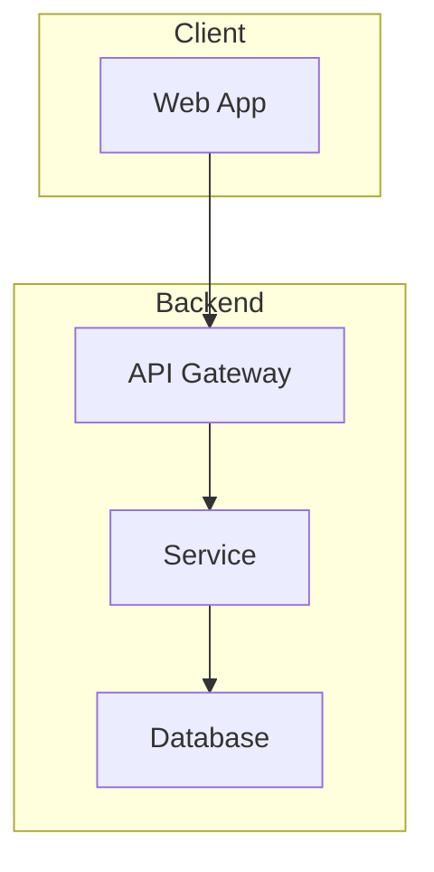
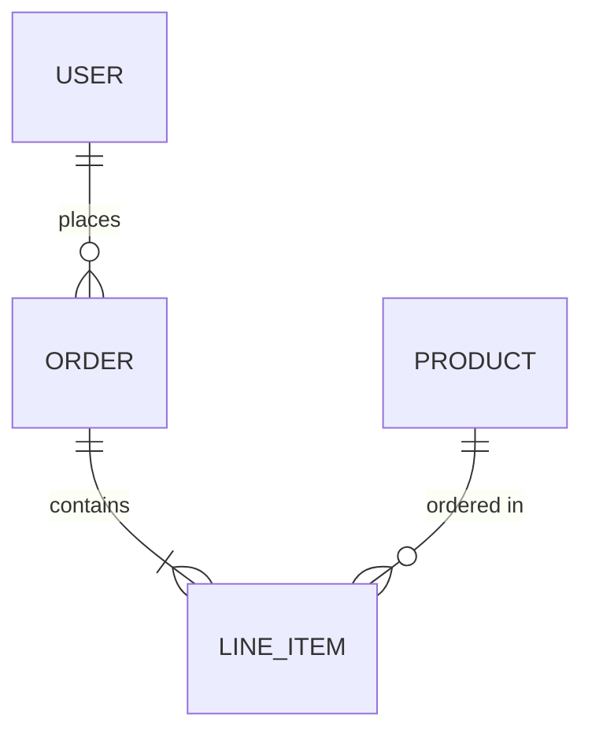

# TRD: [Technical Design Title]

> [!NOTE]
> **Template rules:**
> - Replace all `[bracketed placeholders]` with real content
> - Remove blockquoted guidance (like this) before publishing
> - Keep HTML comments (LLM hints) - they're for AI assistants
> - Include at least one architecture diagram

<!--
LLM HINT: This is a Technical Requirements Document template.
- Focus on HOW, assumes the WHAT/WHY is covered in a linked spec
- Include enough detail for implementation but not line-by-line pseudocode
- Diagrams are preferred over prose for architecture
-->

**Status**: Draft | In Review | Approved | Superseded
**Author**: [Name]
**Last Updated**: YYYY-MM-DD
**Related Spec**: [Link to feature spec if applicable]

## Context

<!-- Why are we building this? What problem does it solve? Link to spec for details. -->

> Provide 2-3 sentences of context. Link to the spec for full requirements. Don't repeat the spec here.

## Architecture

<!-- High-level system architecture. Show components and their relationships. -->

> Replace this example diagram with your actual architecture. Show how components connect.



### Components

<!-- Describe each component's responsibility. Keep descriptions to 1-2 sentences. -->

> List each component from the diagram with its single responsibility.

| Component | Responsibility |
|-----------|----------------|
| [Component 1] | [What it does] |
| [Component 2] | [What it does] |

## Data model

<!--
LLM HINT: Show entity relationships and key fields.
Use ERD for relationships, TypeScript interfaces for structure.
-->

<!-- ERD or schema definition. Show relationships between entities. -->

> Replace with your actual data model. Show how entities relate to each other.



### Key entities

> Define the shape of your main data structures. Include required fields and types.

```typescript
interface Entity {
  id: string;
  createdAt: Date;
  updatedAt: Date;
  // ... other fields
}
```

## API design

<!-- Define key endpoints or interfaces. Include request/response shapes. -->

> Document your public API surface. Include example payloads.

### Endpoints

| Method | Path | Description |
|--------|------|-------------|
| GET | `/api/resource` | List resources |
| POST | `/api/resource` | Create resource |
| GET | `/api/resource/:id` | Get single resource |

### Example request/response

```json
// POST /api/resource
{
  "name": "example",
  "type": "demo"
}

// Response 201
{
  "id": "abc123",
  "name": "example",
  "type": "demo",
  "createdAt": "2025-01-18T00:00:00Z"
}
```

## Trade-offs and alternatives

<!-- Document key decisions and what was considered but rejected. -->

> Document major technical decisions. Explain what you chose, what you rejected, and why.

| Decision | Chosen | Alternative | Rationale |
|----------|--------|-------------|-----------|
| [Decision point] | [What we chose] | [What we didn't] | [Why] |

## Risks and mitigations

<!-- What could go wrong? How do we prevent or handle it? -->

> Identify what could go wrong and how you'll address it.

| Risk | Likelihood | Impact | Mitigation |
|------|------------|--------|------------|
| [Risk description] | Low/Med/High | Low/Med/High | [How we address it] |

## References

- [Feature Spec](../specs/related-spec.md)
- [External API Docs](https://example.com)
