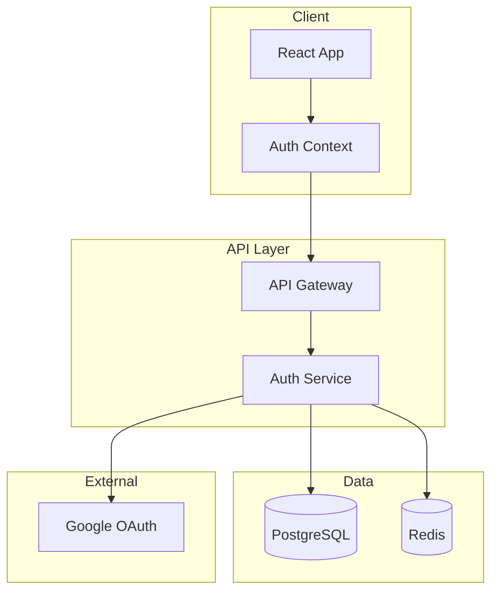
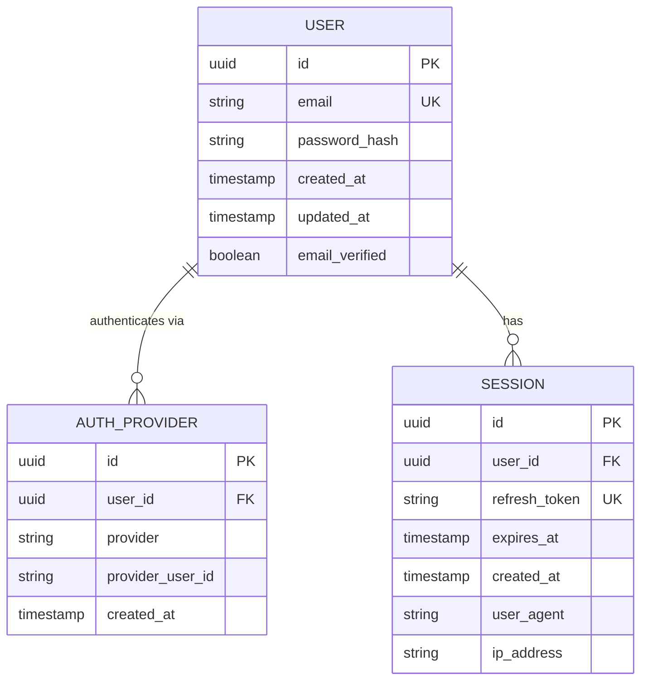

# TRD: Authentication System

<!-- 
LLM HINT: This is an example of a completed TRD.
It demonstrates the template in use for implementing the auth feature.
Shows how a TRD pairs with its feature spec.
-->

**Status**: Approved  
**Author**: Platform Team  
**Last Updated**: 2025-01-16  
**Related Spec**: [User Authentication Spec](../specs/user-authentication.md)

## Context

The platform requires user authentication to enable personalized experiences and protect user data. This TRD covers the technical implementation of email/password and Google OAuth authentication flows, session management, and security controls.

See the [feature spec](../specs/user-authentication.md) for full requirements and user stories.

## Architecture



### Components

| Component | Responsibility |
|-----------|----------------|
| Auth Context | Client-side auth state, token refresh, protected route guards |
| API Gateway | Rate limiting, request validation, route to auth service |
| Auth Service | Credential verification, session creation, OAuth token exchange |
| PostgreSQL | User records, credentials, OAuth provider links |
| Redis | Session storage, rate limit counters, refresh token blacklist |

## Data Model



### Key Entities

```typescript
interface User {
  id: string;
  email: string;
  passwordHash: string | null; // null for OAuth-only users
  emailVerified: boolean;
  createdAt: Date;
  updatedAt: Date;
}

interface Session {
  id: string;
  userId: string;
  refreshToken: string;
  expiresAt: Date;
  userAgent: string;
  ipAddress: string;
}
```

## API Design

### Endpoints

| Method | Path | Description |
|--------|------|-------------|
| POST | `/api/auth/register` | Create new account |
| POST | `/api/auth/login` | Email/password login |
| POST | `/api/auth/logout` | End current session |
| POST | `/api/auth/refresh` | Refresh access token |
| GET | `/api/auth/google` | Initiate Google OAuth |
| GET | `/api/auth/google/callback` | Google OAuth callback |
| GET | `/api/auth/me` | Get current user |

### Example Request/Response

```json
// POST /api/auth/register
{
  "email": "user@example.com",
  "password": "SecureP@ssw0rd!"
}

// Response 201
{
  "user": {
    "id": "usr_abc123",
    "email": "user@example.com",
    "emailVerified": false
  },
  "accessToken": "eyJhbG...",
  "expiresIn": 900
}
```

```json
// POST /api/auth/login
{
  "email": "user@example.com",
  "password": "SecureP@ssw0rd!"
}

// Response 200
{
  "user": {
    "id": "usr_abc123",
    "email": "user@example.com",
    "emailVerified": true
  },
  "accessToken": "eyJhbG...",
  "expiresIn": 900
}

// Response 401 (invalid credentials)
{
  "error": "invalid_credentials",
  "message": "Email or password is incorrect"
}
```

### Token Strategy

- **Access Token**: JWT, 15-minute expiry, stored in memory
- **Refresh Token**: Opaque UUID, 7-day expiry, HttpOnly cookie
- Refresh tokens are single-use; each refresh issues a new pair

## Trade-offs & Alternatives

| Decision | Chosen | Alternative | Rationale |
|----------|--------|-------------|-----------|
| Session storage | Redis | PostgreSQL | Lower latency for frequent session checks |
| Password hashing | bcrypt | Argon2 | Better library support, sufficient security |
| Token format | JWT + Refresh | Session cookies only | Enables stateless API scaling |
| OAuth library | passport.js | Custom | Battle-tested, handles edge cases |

## Risks & Mitigations

| Risk | Likelihood | Impact | Mitigation |
|------|------------|--------|------------|
| Credential stuffing | High | High | Rate limiting (5 failed attempts / 15 min), CAPTCHA after 3 failures |
| Token theft | Medium | High | Short-lived access tokens, refresh rotation, secure cookie flags |
| Redis failure | Low | High | Fallback to PostgreSQL for session validation, circuit breaker |
| OAuth provider outage | Low | Medium | Graceful degradation to email/password, clear error messaging |

## References

- [User Authentication Spec](../specs/user-authentication.md)
- [OWASP Session Management](https://cheatsheetseries.owasp.org/cheatsheets/Session_Management_Cheat_Sheet.html)
- [JWT Best Practices](https://auth0.com/blog/a-look-at-the-latest-draft-for-jwt-bcp/)
